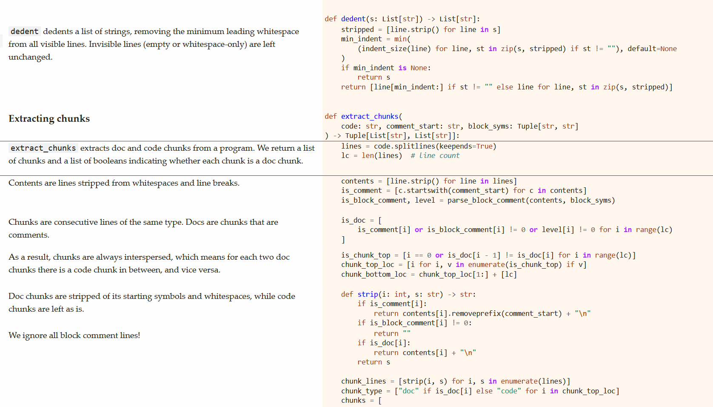

# dok.py

[Dok](https://rebelpotato.github.io/dok.py/) is a quick and dirty tool for turning your script into documentation
that show explainations and code side by side, a.k.a. "semi-[literate programming](https://en.wikipedia.org/wiki/Literate_programming)".
It is simple and language agnostic.

This is very much a remix of [Pycco](https://github.com/pycco-docs/pycco),
which itself is a Python port of [Docco](https://github.com/jashkenas/docco),
the original lightweight literate programming tool. Compared to Pycco and Docco, Dok:

* is simpler and better documented (in my opinion)
* processes most languages, by virtue of being dumb
* has a customizable template that works on mobile out of the box

Dok is written literately and generates its own documentation,
so it should be quite easy to understand, modify and extend.



## Rationale

> "Programs are meant to be read by humans and only incidentally for computers to execute."
>
> -- Donald Knuth

* [Literate programming](https://en.wikipedia.org/wiki/Literate_programming) is
underappreciated and underused, in part because existing tools are quite heavyweight.
* Most major languages support forward definitions, so you don't need to
weave your code using an external tool. Your compiler can do it just fine.
* Debugging can be a pain if you don't know where your code is going to be.
* **LLMs write lots of comments**, so a tool that turns comments into documentation
would make LLMs doubly useful!

So like [Pycco](https://github.com/pycco-docs/pycco) & [Docco](https://github.com/jashkenas/docco),
Dok just extracts your comments into prose, stuff your code in code blocks
and calls it a day.

## Usage

Clone this repository. Dok's own documentation is generated by running

```bash
uv run dok.py -m README.md -H index.html -c '#' -b '"""' '"""' dok.py
```

or in powershell:
```powershell
# note the horrendous quoting
uv run dok.py -m README.md -H index.html -c '#' -b '""""""""' '""""""""' dok.py
```

This tells Dok to read its own source `dok.py`, treat `#` as comment start
and `"""` as block comment delimiters, and generate `README.md` and `index.html`
from it, given that the default html template `template.html` exists in the same folder.

For other languages, use `-l(--language)` to specify the language name for syntax highlighting,
and change the comment and block comment symbols accordingly.

If you're using javascript for instance:
```bash
uv run dok.py -m -H -c '//' -b '/*' '*/' script.js
```
will create `script.js.md` and `script.js.html` from `script.js`,

By itself it's quite dumb and needs to rely on other tools. For example, `scripts/build.py`
watches `dok.py` for changes and reruns it automatically, which
is a very simple way to add file watching abilities to Dok.
(Maybe this is a good thing, Dok is not trying to do everything by itself ;)

## Dependencies

```py
import re
import argparse
from markdown_it import MarkdownIt
from mdit_py_plugins.footnote import footnote_plugin
import pygments
import pygments.formatters
import pygments.lexers
import pystache
from typing import List, Tuple
```

## Terminology

The following terms are used throughout the code, and are important to understand how Dok works:

* line: a string that contains only one newline character `\n`, which should be the string's last character.
* chunk: consecutive lines in a list of lines. We can represent it as a list of lines ...

```py
SOME_LINE = "This is a line.\n"
SOME_CHUNK = [
    "This is not a line,\n",
    "But a chunk.\n",
    "It can be split into three lines.\n",
]
ANOTHER_CHUNK = SOME_CHUNK[1:3]
```

But an index-offset tuple works as well.

```py
A_THIRD_CHUNK = (SOME_CHUNK, 1, 3)
```

* content: a line stripped of leading and trailing whitespaces and line breaks.

```py
SOME_CONTENT = SOME_LINE.strip()
assert SOME_CONTENT == "This is a line."
```

* comment: a line whose content starts with a comment symbol, e.g. `#` in Python.

```py
SOME_COMMENT = "    # This is a comment.\n"
```

* block comment boundary: a line that starts or ends a block comment.

Its content either starts with a block comment start symbol,

```py
SOME_BLOCK_START = '    """ Block comment start.\n'
```

ends with a block comment end symbol,

```py
SOME_BLOCK_END = '    Block comment end. """\n'
```

or both. (These don't show up in the output for now...)

```py
SOME_BLOCK_BOTH = '    """ Block comment start and end. """\n'
```

* block comment: a line surrounded by block comment boundaries.

``` python
""" This line is a block comment boundary, not a block comment,
but this line is.
"""
```

## Main

```py
def main():
```

`main` is Dok's main function. Conceptually, Dok is quite simple.

```py
    args = parse_args()
```

First, it reads a source file, separates it into lines,

```py
    file = args.file[0]
    with file as f:
        lines = f.readlines()
```

then extracts chunks of code and documentation from the lines.

```py
    comment_sym = args.comment[0]
```

Block comments are optional.

```py
    block_syms = tuple(args.block) if args.block else None
```

Chunks that only contain comments and block comments are labeled as documentation,
and all the rest are code chunks.

```py
    chunk_type, chunks, chunk_locs = extract_chunks(lines, comment_sym, block_syms)
```

After that, it formats the chunks and produce markdown and/or HTML.
It uses the file's extension to determine the language if not specified.

```py
    lang = args.language[0] if args.language else file.name.split(".")[-1]
    if args.markdown is not None:
        markdown_file = args.markdown or open(f"{file.name}.md", "w", encoding="utf8")
        with markdown_file as f:
            f.write(f"# {file.name}\n\n" + to_markdown(chunk_type, chunks, lang))

    if args.html is not None:
```

Formatting HTML needs a template.

```py
        template_file = (
            args.template
            if args.template
            else open("template.html", "r", encoding="utf8")
        )
        with template_file as f:
            template = f.read()
        html_file = args.html or open(f"{file.name}.html", "w", encoding="utf8")
        with html_file as f:
            f.write(
                to_html(
                    chunk_type=chunk_type,
                    chunks=chunks,
                    chunk_locs=chunk_locs,
                    language=lang,
                    comment_sym=comment_sym,
                    file_name=file.name,
                    template=template,
                )
            )
```

And that's it!

## Extracting chunks

```py
def extract_chunks(
    lines: List[str], comment_sym: str, block_syms: Tuple[str, str] | None = None
) -> Tuple[List[str], List[List[str]], List[int]]:
```

`extract_chunks` extracts doc and code chunks from a program. We return a list of chunks,
a list of strings indicating each chunk's type (doc or code),
and a list of locations of the top of each chunk.

```py
    lc = len(lines)  # line count
```

Contents are lines stripped from leading and trailing whitespaces and line breaks.

```py
    contents = [line.strip() for line in lines]
    is_comment = [c.startswith(comment_sym) for c in contents]
    is_block_comment, level = (
        parse_block_comment(contents, block_syms)
        if block_syms
        else ([0] * lc, [0] * lc)
    )
```

Chunks are consecutive lines of the same type. Docs are chunks that are comments.

```py
    is_doc = [
        is_comment[i] or is_block_comment[i] != 0 or level[i] != 0 for i in range(lc)
    ]
```

As a result, chunks are always interspersed, which means
for each two doc chunks there is a code chunk in between, and vice versa.
So changes in chunk type marks the start of a new chunk.

```py
    is_chunk_top = [i == 0 or is_doc[i - 1] != is_doc[i] for i in range(lc)]
    chunk_top_loc = [i for i, v in enumerate(is_chunk_top) if v]
    chunk_bottom_loc = chunk_top_loc[1:] + [lc]
```

Doc chunks are stripped of its starting symbols and whitespaces,
while code chunks are left as is.

```py
    def strip(i: int, s: str) -> str:
        if is_comment[i]:
            return contents[i].removeprefix(comment_sym) + "\n"
        if is_block_comment[i] != 0:
```

We ignore all block comment lines!

```py
            return ""
        if is_doc[i]:
            return contents[i] + "\n"
        return s

    chunk_lines = [strip(i, s) for i, s in enumerate(lines)]
    chunk_type = ["doc" if is_doc[i] else "code" for i in chunk_top_loc]
    chunks = [chunk_lines[i:j] for i, j in zip(chunk_top_loc, chunk_bottom_loc)]
    return chunk_type, chunks, chunk_top_loc


def parse_block_comment(
    contents: List[str], block_syms: Tuple[str, str]
) -> Tuple[List[int], List[int]]:
```

`parse_block_comment` takes in a list of contents and parses out block comments.
 `is_block_comment` is 0 for non-block-comment lines,
 1 for a comment start line, and -1 for a comment end line.
 TODO: handle single-line block comments.

```py
    is_block_comment = [
        1 if c.startswith(block_syms[0]) else -1 if c.startswith(block_syms[1]) else 0
        for c in contents
    ]
    if block_syms[0] == block_syms[1]:
```

If the start and end of a block comment is one symbol,
every other symbol must be an end quote.

```py
        block_comment_locs = [i for i, v in enumerate(is_block_comment) if v == 1]
        for i, p in enumerate(block_comment_locs):
            if i % 2 == 1:
                is_block_comment[p] = -1
```

`level` is the nesting level of block comments.

```py
    def next_level(seen: int, v: int) -> int:
```

We don't handle recursive block_comments, because most languages don't support them.
If we do, we would need to increment `seen_quote` here.
Using `max`, this code works even if there are more end quotes than start quotes.

```py
        return 1 if v == 1 else max(0, seen - 1) if v == -1 else seen

    level = list(running(next_level, is_block_comment, 0))
    return is_block_comment, level
```

## Formatting

```py
def to_markdown(chunk_type: List[str], chunks: List[List[str]], language: str) -> str:
```

`to_markdown` convert chunks to markdown. It is quite simple!

```py
    md = []
    for i, chunk in enumerate(chunks):
        if chunk_type[i] == "doc":
```

For markdown, we dedent doc chunks for better readability.

```py
            md.append("".join(dedent(chunk)))
        else:
```

We strip trailing spaces and newlines off code chunks, so that
each code block ends with actual code instead of empty lines.

```py
            stripped = "".join(chunk).rstrip()
            if stripped != "":
                md.append(f"```{language}\n{stripped}\n```\n")
    return "\n".join(md)
```

HTML's more tricky though, because it needs styling and formatting.
We use pygments for code highlighting and markdown-it for markdown formatting.
For markdown, we use the commonmark spec with tables and footnotes enabled.

```py
HTML_FORMATTER = pygments.formatters.HtmlFormatter()
MD = MarkdownIt("commonmark").use(footnote_plugin).enable("table")


def to_html(
    chunk_type: List[str],
    chunks: List[List[str]],
    chunk_locs: List[int],
    language: str,
    comment_sym: str,
    file_name: str,
    template: str,
) -> str:
```

`to_html` convert chunks to HTML. This function is quite big for now,
need to break it down into smaller functions soon.

```py
    code_locs = [i for i, t in enumerate(chunk_type) if t == "code"]
    code_html = highlight(
        code_chunks=[chunks[i] for i in code_locs],
        chunk_locs=[chunk_locs[i] for i in code_locs],
        language=language,
        comment_sym=comment_sym,
    )

    docs_locs = [i for i, t in enumerate(chunk_type) if t == "doc"]
    docs_html = [MD.render("".join(chunks[i])) for i in docs_locs]
```

Join the code and doc html strings together.

```py
    html = [""] * len(chunks)
    for i, v in zip(code_locs, code_html):
        html[i] = v
    for i, v in zip(docs_locs, docs_html):
        html[i] = v
```

This pairing is set up, so that two consecutive chunks of the same type
remain together in the output view.

```py
    sections = []
    doc, code = "", ""
    for i, s in enumerate(html):
        if chunk_type[i] == "doc" and doc != "":
            sections.append((doc, code))
            doc, code = "", ""
        elif chunk_type[i] == "code" and code != "":
            sections.append((doc, code))
            doc, code = "", ""
        doc, code = (s, code) if chunk_type[i] == "doc" else (doc, s)
    sections.append((doc, code))
    return pystache.render(
        template,
        {
            "title": file_name,
            "sections": [
                {
                    "num": i + 1,
                    "doc": doc,
                    "code": code,
                }
                for i, (doc, code) in enumerate(sections)
            ],
        },
    )


def highlight(
    code_chunks: List[List[str]], chunk_locs: List[int], language: str, comment_sym: str
) -> List[str]:
```

`highlight` turns a list of code chunks into HTML using pygments.
The code chunks are merged and passed to pygments in one go,
because pygment can't highlight partial code.
 Magic divider text and html adapted from pycco.

```py
    divider_text = f"{comment_sym}DIVIDER\n"
    divider_html = re.compile(rf'<span class="c[1]?">{comment_sym}DIVIDER</span>\n')
```

To do this, we join all code chunks into a single program
with a piece of divider text in between,

```py
    joined_code = divider_text.join(map(lambda c: "".join(c), code_chunks))
```

highlight the whole thing using pygments,
(TODO: map line numbers)

```py
    lexer = pygments.lexers.get_lexer_by_name(language)
    output = (
        pygments.highlight(joined_code, lexer, HTML_FORMATTER)
        .replace('<div class="highlight"><pre>', "")
        .replace("</pre></div>\n", "")
    )
```

then split it into html to get the html for each code section.

```py
    htmls = [
        f'<div class="highlight"><pre>{s}</pre></div>'
        for s in re.split(divider_html, output)
    ]
    return htmls
```

## Appendix
### Command line interface

```py
def parse_args():
    parser = argparse.ArgumentParser(description="A simple literate programming tool.")
```

TODO: add rationale for the arguments

```py
    parser.add_argument(
        "-m",
        "--markdown",
        type=argparse.FileType("w", encoding="utf8"),
        nargs="?",
        const=False,
        help="generate markdown output",
    )
    parser.add_argument(
        "-H",
        "--html",
        type=argparse.FileType("w", encoding="utf8"),
        nargs="?",
        const=False,
        help="generate HTML output",
    )
    parser.add_argument(
        "-t",
        "--template",
        type=argparse.FileType("r", encoding="utf8"),
        nargs="?",
        const=False,
        help="HTML template file",
    )
    parser.add_argument(
        "-l",
        "--language",
        type=str,
        nargs=1,
        help="language name (for syntax highlighting)",
    )
    parser.add_argument(
        "-c",
        "--comment",
        type=str,
        nargs=1,
        default=["#"],
        help="comment start symbol (default: '#')",
    )
    parser.add_argument(
        "-b",
        "--block",
        type=str,
        nargs=2,
```

Some languages don't have block comments, so we default to None.

```py
        help="block comment start and end symbols (default: None)",
        default=None,
    )
    parser.add_argument(
        "file",
        type=argparse.FileType("r", encoding="utf8"),
        nargs=1,
        help="source file to process",
    )
    return parser.parse_args()
```

### Utility functions

```py
def running(f, iterable, init=None):
```

`running` calculates a running value from an iterable using a binary function `f`.

```py
    for x in iterable:
        init = x if init is None else f(init, x)
        yield init


def running_sum(iterable, init=None):
```

`running_sum` calculates the running sum of an iterable.

``` py
>>> list(running_sum(range(5)))
[0, 1, 3, 6, 10]

>>> list(running_sum(range(5), 10))
[10, 11, 13, 16, 20]

```

```py
    return running(lambda x, y: x + y, iterable, init)


def leading_count(char: str, s: str) -> int:
```

`leading_count` counts the number of leading characters `char` in a string `s`.

```py
    for i, c in enumerate(s):
        if c != char:
            return i
    return len(s)


def dedent(s: List[str]) -> List[str]:
```

`dedent` dedents a list of strings, removing the minimum leading whitespace
from all visible lines. Invisible lines (empty or whitespace-only)
are left unchanged.

``` py
>>> dedent(["    4 spaces", "  2 spaces", "", "   3 spaces"])
['  4 spaces', '2 spaces', '', ' 3 spaces']

```

```py
    stripped = [line.strip() for line in s]
    min_indent = min(
        (leading_count(" ", line) for line, st in zip(s, stripped) if st != ""),
        default=None,
    )
    if min_indent is None:
        return s
    return [line[min_indent:] if st != "" else line for line, st in zip(s, stripped)]
```

## Finally, start the script

```py
if __name__ == "__main__":
    main()
```
